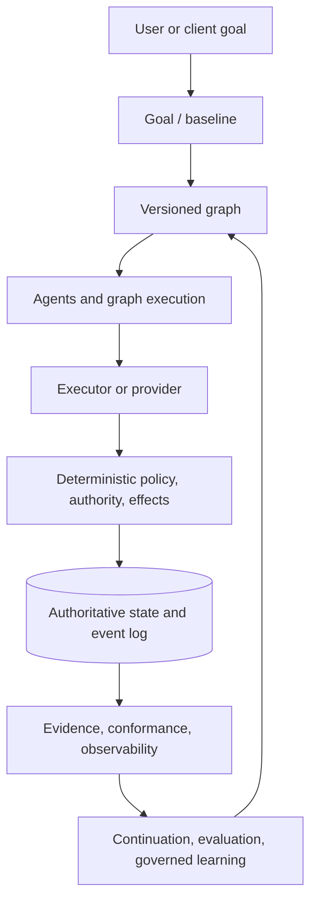

# Praxis

**Praxis is a persistent, deterministic execution architecture for AI work.**

It is not a prompt library, persona collection, agent-prompt bundle, or coding-agent wrapper. Models and providers may propose or perform bounded work, but Praxis owns the durable facts that make work legal: graph transitions, capability and resource authority, approvals, effects, persistence, package activation, recovery, and evidence.

## Why Praxis exists

AI systems are useful at reasoning but are a poor authority for their own state. A process can restart, a provider can change, a prompt can contain hostile instructions, and a model can claim that work happened without producing admissible evidence. Praxis places deterministic boundaries below those failure modes. The result is resumable work whose state, identity, authority, and evidence can be inspected and replayed.

## Current release status

Praxis 2 release qualification is complete for the qualified source commit [`c5c5e7937b5d1c7562a72d90d761cd630baf7369`](https://github.com/convergent-systems-co/praxis/commit/c5c5e7937b5d1c7562a72d90d761cd630baf7369). The frozen whole-system result covers **38/38 qualified original-intent claims** with 0 unsupported, 0 indeterminate, and 0 contradicted findings. The exact evidence is in [`blind-praxis2-release-qualified-v1.json`](docs/research/conformance/blind-praxis2-release-qualified-v1.json) and the versioned release-oracle qualification in [`praxis2-release-oracle-qualification-v1.json`](docs/research/conformance/praxis2-release-oracle-qualification-v1.json).

This release-preparation branch documents and packages that qualified source. It does not replace the qualified source reference.

## What is shipped

| Surface | Status | Description |
| --- | --- | --- |
| Go control plane | Shipped | Durable SQLite state, event/replay boundaries, package lifecycle, dynamic invocation registry, status/doctor/version, resume/cancel contracts, and provider-neutral state interfaces. |
| Python compatibility/runtime package | Shipped | Graph loading, deterministic transitions, evidence gates, executor adapters, overlays, and the read-only dashboard. Install from `pyproject.toml`; it is a separate compatibility surface. |
| Executors/providers | Shipped and optional | Local subprocess, fake/test, Claude CLI, Codex CLI, GitHub Copilot CLI, Ollama, and MLX server adapters where their local prerequisites are present. |
| Packages and plugins | Shipped as governed runtime surfaces | Signed, digest-bound package contents, dynamic invocation contracts, and supervised plugin boundaries. A package source must provide a compatible signed release. |
| Goals, agents, learning, Workspace Intelligence | Shipped as runtime/library capabilities | Their durable contracts and qualification evidence are present; this candidate does not pretend that every capability has a dedicated top-level CLI command. |
| Commercial services or hosted control plane | Not shipped | Praxis is local-first and does not include a hosted service or managed provider account. |

## Architecture at a glance



The runtime, not the model, owns the transitions and authoritative state. A provider can be replaced only through its declared identity and capability contract. A restart reconstructs state from durable records; it does not trust an in-memory claim of readiness.

## Install and first useful workflow

The detailed procedures are in the [Installation Guide](docs/installation.md). The shortest source checkout verification is:

```bash
git clone https://github.com/convergent-systems-co/praxis.git
cd praxis
git checkout c5c5e7937b5d1c7562a72d90d761cd630baf7369
go test ./...
go build -o praxis ./cmd/praxis
./praxis version
./praxis doctor
```

For the Python compatibility surface, use Python 3.10 or newer:

```bash
python3.11 -m venv .venv
. .venv/bin/activate
python -m pip install .
praxis doctor
praxis run examples/sample-graph.json --run-dir "$PWD/.praxis/example-run"
python -m praxis_dashboard --graph examples/sample-graph.json --run-dir "$PWD/.praxis/example-run" --replay-only
```

The Python command runs a seven-node example, persists `run-state.json` and an append-only event log, and the dashboard reads that state without becoming execution authority. The `trivial` overlay is an evidence-gated proving fixture, not the zero-configuration quickstart; it requires a `trivial.quality-check` proof from an appropriate executor.

## Documentation

- [Installation Guide](docs/installation.md)
- [User Guide](docs/user-guide.md)
- [Customization Guide](docs/customization.md)
- [Architecture Guide](docs/architecture-guide.md)
- [Troubleshooting and Operations](docs/operations.md)
- [Executor and provider reference](docs/executors.md)
- [Package and distribution reference](docs/distribution.md)
- [Security and authority model](docs/security.md)
- [Development guide](CONTRIBUTING.md)
- [Release notes](RELEASE_NOTES.md)

Engineering authority remains in [`docs/ADR`](docs/ADR), [`docs/SPEC`](docs/SPEC), and [`docs/PLAN`](docs/PLAN). Those files explain why the system is shaped this way; the guides above explain how to use the shipped surfaces.

## Core Go CLI

The Go binary is `praxis`. Its current core commands are:

```text
praxis help
praxis version
praxis doctor
praxis status <run-id> [--db <path>]
praxis resume <run-id> --actor-id <id> --actor-kind <kind> --wait-kind <kind> --wait-ref <ref> [--db <path>]
praxis cancel <run-id> --actor-id <id> --actor-kind <kind> [--db <path>]
praxis discover | info | install | update | rollback | disable | uninstall | list
```

Durable commands require `PRAXIS_DB` or an explicit database option. Praxis does not silently select an authoritative database. Package lifecycle commands additionally require the authority and approval environment variables described in the [Installation Guide](docs/installation.md) and [Operations Guide](docs/operations.md).

Installed package invocation aliases are resolved dynamically from the active, digest-bound registry. Praxis does not compile domain names such as `develop` or `research` into the core CLI.

## Usage

This repository ships and tests the Python compatibility surface alongside the Go control plane. The examples in this section describe the installed Python `praxis` console script after the Python environment is activated.

### Quickstart: drive a graph to completion

`praxis run` is the shipped compatibility command that drives a graph to completion. The zero-configuration example is `examples/sample-graph.json`; the `trivial` overlay is deliberately evidence-gated and is useful for testing a custom `trivial.quality-check` proof. The equivalent library path uses `build_trivial_graph`, a `TransitionEngine`, and a `FakeExecutor`; a failed evidence gate raises `TransitionError`.

```python
from overlays.trivial.overlay import build_trivial_graph
from praxis_runtime.testing.fake_executor import FakeExecutor
from praxis_runtime.transitions import TransitionEngine, TransitionError

graph = build_trivial_graph()
```

### Inspecting a run: the dashboard

The dashboard reads the graph and durable run directory without becoming execution authority.

```bash
python -m praxis_dashboard --graph examples/sample-graph.json --run-dir /path/to/run-dir --replay-only
python -m praxis_dashboard --graph examples/sample-graph.json --run-dir /path/to/run-dir
```

### Inspecting executors: the `praxis` CLI

The installed compatibility CLI provides read-only executor inspection:

```bash
praxis executors
praxis executors --json
praxis executors discover
praxis executors match --capability coding --capability reasoning --explain
```

An unavailable adapter degrades its own row rather than hiding other adapters. `--json` is available only for the bare executor status table; neither `doctor` nor `run` accepts `--json`. The compatibility dispatcher recognizes exactly the first arguments `executors`, `doctor`, and `run`; any other first argument prints the package version and exits 0.

### Checking an install: `praxis doctor`

```bash
praxis doctor
praxis doctor --graph examples/sample-graph.json --overlay-manifest path/to/overlay-manifest.json
```

Doctor performs five checks in order: prerequisites and the Python/runtime version, configuration, graph/overlay schema validity, executor discovery, and policy. There is no user configuration file to validate today. The graph/overlay check validates only explicitly supplied documents and never scans the working tree. Every check ends with an `ok`, `warn`, or `fail` verdict. Doctor exits 0 when no check is `fail`, and exits 1 when at least one check is `fail`. A machine with no `claude` binary and no Ollama service receives a `warn` and still exits 0.

### Driving a graph: `praxis run`

```bash
praxis run trivial --run-dir /path/to/run-dir
praxis run examples/sample-graph.json --capability coding --run-dir /path/to/run-dir
praxis run development --executor executor-id --run-id my-run --run-dir /path/to/run-dir
```

`<target>` is either a JSON graph document path or the shipped overlay id `trivial` or `development`. `--executor` defaults to `auto`; an explicit choice remains subject to policy, so a policy-denied executor is refused. It must still satisfy the node requirement, and the node is refused when it does not. The command exits 0 when every node reaches a terminal state, and exits nonzero as soon as a node fails closed. `--run-dir` is required and receives `run-state.json` plus the event directory that `python -m praxis_dashboard --run-dir` reads. A directory already containing `run-state.json` is refused. Resuming an existing run is not supported by this compatibility command.

### Running the test suite

```bash
python -m pytest
go test ./...
```

## Persistence, evidence, and security

The reference authoritative provider is SQLite. Package generations, approvals, leases, run events, projections, encrypted blobs, and receipts are bound to identities and digests. Python compatibility runs store a checkpoint and append-only events under the caller-selected `--run-dir`; the Go control plane stores its durable state in the caller-selected `PRAXIS_DB`.

Evidence is separate from authority. A proof or provider response can be inspected, graded, and replayed, but it cannot mint approval, readiness, verification, package activation, or execution authority merely by claiming those facts. Untrusted content is evidence rather than executable instruction. Security-sensitive requirements fail closed when the configured provider cannot satisfy them.

## License

Praxis is source-available under the [PolyForm Noncommercial License 1.0.0](LICENSE). See [NOTICE](NOTICE) for the required notice. Commercial use requires separate written permission.
