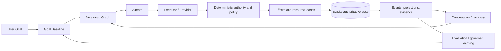

# Architecture Guide

## Execution relationship

The arrows are responsibility boundaries, not a promise that every installation exposes every step as a shell command. The Go control plane is the release-qualified authority boundary. The Python runtime is the compatibility/reference graph execution surface.

## Ownership and authority

- The graph owns legal control flow.
- The runtime owns durable truth and transitions.
- The state provider owns transactional persistence semantics.
- Policy owns eligibility, budgets, isolation, and authority requirements.
- The executor/provider owns external work and reports observations.
- Evidence graders evaluate observations; they do not grant approval.
- Package activation owns immutable registry publication after verification and independent approval.
- A user or explicitly governed actor owns approval decisions.

Caller-controlled input cannot mint confirmation, readiness, verification, promotion, package activation, execution authority, or a successful effect outcome. Unknown or unsupported required semantics fail closed.

## Persistent state and replay

Go state is stored in the explicit `PRAXIS_DB` SQLite database. The event store appends versioned events with optimistic concurrency; projections are disposable views. Package, approval, lease, effect, plugin, and run identities are bound to exact generations and digests.

Python graph runs store an atomic checkpoint and append-only JSONL events under `--run-dir`. `resume()` reconciles events after the checkpoint before returning an engine. A malformed, gapped, ahead-of-log, or schema-incompatible record is rejected rather than guessed through.

## Package and graph lifecycle

Package discovery is transport evidence. Signed manifest bytes, artifact bytes, publisher trust, dependency locks, content digests, capabilities, and policy are evaluated before activation. Activation atomically publishes the verified generation and its graph/agent/invocation registrations. Update and rollback retain immutable history; disable/uninstall withdraw new discovery while preserving replay lineage.

Graphs are selected by stable semantic ID/version and exact content identity. A graph file’s ordering or path is not its identity. Subgraphs bind exact child graph generations.

## Agents, providers, and restart

An agent definition is not an agent identity. Instantiation creates a local identity/generation with owner, graph, memory, preference, and lineage bindings. Provider replacement requires a fresh capability/session identity; a stale process or lease cannot become authoritative after restart.

Plugins run behind protocol, instance/session, isolation, supervision, and capability-lease boundaries. Installation alone grants no plugin authority.

## Evidence, conformance, and self-improvement

Evidence is content-addressed and contextual. A conformance result is frozen before oracle evaluation; current release oracle authority is versioned separately from immutable historical evidence. The qualified release has 38/38 satisfied original-intent claims under the current release context; see the exact frozen result and oracle artifacts linked in the README.

Learning extracts deterministic candidates from observations and evaluates them against the original goal, regression corpus, security constraints, and cost policy. Promotion is separate from proposal and retains rollback. A learned pattern cannot directly rewrite authority, security, or run legality.

## Portability and security

SQLite is the reference provider, not the architectural definition. A future provider must satisfy the semantic state-provider contract. Secure blobs authenticate content and security metadata; cryptographic profiles are explicit and post-quantum requirements fail closed when unavailable. Untrusted workspace/package/provider content remains evidence until deterministic validation grants it no more authority than the governing contract allows.
